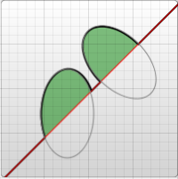

[[toc]]

## 引言

**SVG（Scalable Vector Graphics）** 应该是浏览器发展历史以来，曲线绘画支持度最高的一块内容了。HTML 提供了定义段落、表格、标题等内容的元素，SVG 提供了用于定义矩形、复杂曲线图形的元素，之后 SVG 也变得复杂起来，渐变、旋转、动画、滤镜等效果，以及和 JS 交互也都慢慢加上了。

SVG 自 2003 年被 W3C 作为推荐标准以来，最接近的完整版本是 1.1 版，在 2011 年 SVG1.1 的第二个版本成为推荐版本，完整的 SVG1.2 本来是下一个标准版本，但是被 [SVG 2.0](https://www.w3.org/TR/SVG2/Overview.html) 取代了。针对移动端，SVG 在 2003 年推出了 **SVG Tiny** 和 **SVG Basic**，在 2008 年 SVG Tiny1.2 成为 W3C 推荐标准。

## 入门
SVG 是由 `<svg>` 标签包裹的一组元素，也可以说是 **XML** 用来描述图形和绘图程序的语言。简单看一个例子：

<div text-center>
  <SVGDemo1 />
</div>


```html
<svg 
  version="1.1"
  baseProfile="full"
  width="300"
  height="200"
  xmlns="http://www.w3.org/2000/svg"
>
  <rect width="100%" height="100%" fill="rgb(248,113,113)" />
  <circle cx="150" cy="100" r="80" fill="rgb(74,222,128)" />
  <text x="150" y="125" font-size="60" text-anchor="middle" fill="white">
    Dao
  </text>
</svg>
```
以上就是一个简单的 SVG 文件效果，其中：
* [version](https://developer.mozilla.org/zh-CN/docs/Web/SVG/Attribute/version) 表示 SVG 遵循的版本规范，只有 `1.0` 和 `1.1` 这两个有效选择。
* [baseProfile](https://developer.mozilla.org/zh-CN/docs/Web/SVG/Attribute/baseProfile) 表示一个 SVG 的描述，取值为 `none` | `full` | `basic` | `tiny`。
* [width](https://developer.mozilla.org/zh-CN/docs/Web/SVG/Attribute/width) 和 [height](https://developer.mozilla.org/zh-CN/docs/Web/SVG/Attribute/height) 表示 SVG 整体容器的宽高。
* [xmlns](https://developer.mozilla.org/zh-CN/docs/Web/SVG/Namespaces_Crash_Course) 表示 SVG 遵循的命名空间（作为 XML 语言需要正确命名它）。

*在 SVG2 后，不再需要 basePofile 和 version。*

> 在 XML 中，标签和属性属于命名空间，这是为了防止来自不同技术的标签和属性发生冲突。例如在 SVG 中存在 a 标签，在 HTML 中也存在 a 标签，那么怎么区分这个 a 标签属于哪一种技术，这就需要使用命名空间了。 加入命名空间以后我们就能知道哪一个是 svg:a，哪一个又是 html:a，这样我们就可以区分出不同的标签和属性。

### 文件属性和类型
SVG 中元素的渲染顺序是 “后来居上”，越后面的越可见。在 Web 上渲染 SVG 一般有两种：直接渲染 SVG 文件 和 嵌入到 HTML 中：
* `application/xhtml` 类型的文件，可以直接把 SVG 嵌入 XML 里。
* 可以通过 `<object />`、`<iframe />`、`<embed>`、`` 、`background-image` 以及行内引入，更多的说明可以查看 [W3C 对于SVG 使用的说明](https://www.w3.org/Graphics/SVG/IG/resources/svgprimer.html#SVG_in_HTML)。 

SVG 文件同样支持压缩，通过 [gzip](https://www.gzip.org/) 的方式压缩之后，会生成 `.svgz` 后缀的压缩文件，当然想要正常访问需要在服务端添加相关 gzip 的配置。对于普通的 SVG 文件，服务端会发送这种请求头：

```js
Content-Type: image/svg+xml
```

而对于压缩的 SVG 文件，则会发送这种：

```js
Content-Type: image/svg+xml
Content-Encoding: gzip
```

### 坐标系统


和 [Canvas](https://developer.mozilla.org/zh-CN/docs/Web/API/Canvas_API) 差不多， SVG 使用的坐标左上角是（0, 0），坐标以像素为单位，x 轴正方向是右，y 轴正方向是下。

在 SVG 文档中的 1 个像素对应输出设备的 1 个像素，由于 SVG 是可缩放的，所以它可以对应 绝对单位 或者 相对单位，在 [CSS 长度单位](https://www.w3.org/Style/Examples/007/units.zh_CN.html) 中对 em、px、pt、cm 等有相关介绍。默认情况下 1 个用户单位等于 1 个屏幕单位，但是在使用的时候要标明，SVG 通过 **容器** 和 **绘制区域** 来实现：

```html
<!-- 容器的大小为 100x100 -->
<svg width="100" height="100" />
```
定义一个 100x100px 的容器，这时候 1 个用户单位等于 1 个屏幕单位。

```html
<!-- 容器的大小为 100x100，绘制区域为 50x50 -->
<svg width="100" height="100" viewBox="0 0 50 50" />
```
把 50x50 的绘制内容放到 100x100 的容器上展示，这个时候就会放大两倍。

在某些文章描述中，会把容器称之为 `视口范围（viewport）`，把绘制区域称之为 `可视区域（viewBox）`，所以也可以这样做个总结：**当 viewBox 小于 viewport 时会放大，当 viewBox 大于 viewport 时会缩小，二者相同时等同于没有 viewBox。**

如果你想深入了解坐标系统，可以看下 Sara Soueidan 的 [Understanding SVG Coordinate Systems and Transformations](https://www.sarasoueidan.com/blog/svg-coordinate-systems/)，她也有一个非常棒的 [在线 Demo](https://www.sarasoueidan.com/demos/interactive-svg-coordinate-system/index.html) 来让你熟悉 SVG 坐标系统。


### 基本形状
SVG 有 6 种基本形状：`矩形（rect）`、`圆形（circle）`、`椭圆形（ellipse）`、`线条（line）`、`折线（polyline）`、`多边形（polygon）`：

<div text-center scale-80>
  <SVGDemo2 />
</div>

```html
<!-- 上图的 svg 示例 -->
  <svg 
    version="1.1"
    baseProfile="full"
    width="600" height="300"
    xmlns="http://www.w3.org/2000/svg"
  >
    <rect width="100" height="100" fill="red" />
    <circle
      cx="280" cy="50"r="50"
      fill="green" 
    />
    <ellipse
      cx="500" cy="50" rx="70" ry="30" 
      fill="blue" stroke-width="5"
     />
    <line
      x1="480" y1="150" 
      x2="580" y2="250" 
      stroke="yellow" stroke-width="8" 
    />
    <polyline
      points="200 180 250 240 300 180 350 240 400 200"
      stroke="orange" 
      fill="transparent" 
      stroke-width="5"
    />
    <polygon
      points="50 160 55 180 70 180 60 190 65 205 
      50 195 35 205 40 190 30 180 45 180"
      fill="cyan" 
    />
  </svg>
```
#### 矩形

<div text-center>
<svg width="100" height="100">
<rect
  x="10" y="10" 
  rx="10" ry="10" 
  width="80" height="80" 
  stroke="yellow" stroke-width="8"
  fill="red"
/>
</svg>
</div>

```html
<rect
  x="10" y="10" 
  rx="10" ry="10" 
  width="80" height="80"
  stroke="yellow" stroke-width="8"
  fill="red"
/>

<!-- 
  x、y：矩形左上角坐标
  rx、ry：四个角的圆方位半径
  width、height：矩形的宽高
  stroke、stroke-width：边框颜色和长度
  fill：内容填充颜色
-->
```

#### 圆形

<div text-center>
<svg width="100" height="100">
<circle
  cx="50" cy="50" r="40"
  stroke="green" stroke-width="10"
  fill="yellow"
/>
</svg>
</div>

```html
<circle
  cx="50" cy="50" r="40"
  stroke="green" stroke-width="10"
  fill="yellow"
/>

<!-- 
  cx、cy：圆心位置
  r：半径 
-->
```
#### 椭圆形

<div text-center>
<svg width="100" height="100">
<ellipse
  cx="50" cy="50"
  rx="40" ry="25" 
  stroke="sky" stroke-width="8"
  fill="green"/>
/>
</svg>
</div>

```html
<circle
  cx="50" cy="50" r="40"
  stroke="green" stroke-width="5"
  fill="emerald"
/>

<!-- 
  cx、cy：椭圆心位置
  rx、ry：椭圆的 x 和 y 半径
-->
```
#### 线条

<div text-center>
<svg width="100" height="100">
<line
  x1="10" y1="10"
  x2="80" y2="80"
  stroke="blue" stroke-width="5"
/>
</svg>
</div>

```html
<line
  x1="10" x2="50"
  y1="110" y2="150"
  stroke="green" stroke-width="5"
  fill="emerald"
/>

<!-- 
  x1、y1：起点位置
  x2、y2：终点位置
-->
```
#### 折线

<div text-center>
<svg width="100" height="100">
<polyline 
  points="10,10 30,80 50,20 75,80 90,10" 
  stroke="fuchsia" stroke-width="5"
  fill="yellow"
/>
</svg>
</div>

```html
<polyline 
  points="10 10, 30 80, 50 20, 75 80, 90 10" 
  stroke="fuchsia" stroke-width="5"
  fill="yellow"
/>

<!-- 
  points：点集数列，空白、逗号、终止命令符或换行符隔开，
    每个点必须有两个数字，表示 x 和 y 坐标。
-->
```
#### 多边形

<div text-center>
<svg width="100" height="100">
<polygon
  points="10,10 30,80 50,20 75,80 90,10" 
  stroke="pink" stroke-width="5"
  fill="lime"
/>
</svg>
</div>

```html
<polyline 
  points="10 10, 30 80, 50 20, 75 80, 90 10" 
  stroke="fuchsia" stroke-width="5"
  fill="yellow"
/>

<!-- 折线的终点和起点连起来就是多边形
  points：同折线，点集数列
-->
```


### 路径

路径是 SVG 中最常见的形状，以 `path` 标签命名，除了可以绘制以上六种形状，还可以绘制一些曲线（二次/三次贝塞尔曲线），所以也可以把上面六种形状理解为路径的语法糖。

在折线和多边形里提到点集数列 `points`，路径里用 [`d`](https://developer.mozilla.org/zh-CN/docs/Web/SVG/Attribute/d) 代替：

```html
<path d="M 20 230 Q 40 205, 50 230 T 90230" />
```
`d` 是一个 “命令 + 参数” 的序列（可以把 d 理解为 draw），命令表示将要执行什么，参数表示如何执行，比如：`M 10 10` 表示 Moveto 移动到 （10，10）的位置。每个命令都有 大写字母 和 小写字母 之分，大写字母表示绝对定位，小写字母表示相对定位，所以命令就有两种表述：**从上一个点开始，线上移动6，向右移动10。** 或者 **从上一个点开始，移动到坐标（6，10）处。**
#### 直线命令
* M（Moveto），表示仅移动到某个点，不画线。
* H（Horizontal lineto），表示水平画线到某个点。
* V（Vertical lineto），表示垂直画线到某个点。
* L（LineTo），在当前位置和指定位置之间画一条直线。
* Z（Close），表示画线闭合至起点。

<div text-center>
<svg width="100" height="100">
  <path d="M10 10 H 90 V 90 H 10 Z" fill="transparent" stroke="cyan" stroke-width="2" />
   <circle cx="10" cy="10" r="2" fill="red"/>
   <circle cx="90" cy="90" r="2" fill="red"/>
   <circle cx="90" cy="10" r="2" fill="red"/>
   <circle cx="10" cy="90" r="2" fill="red"/>
</svg>
</div>

```html
<svg width="100" height="100">
  <path
    d="M10 10 H 90 V 90 H 10 Z" 
    fill="transparent" stroke="blue" stroke-width="2"
  />

   <!-- 上面的 path 等价于 -->
   <path d="M10 10 h 80 v 80 h -80 Z" />

  <!-- Points -->
   <circle cx="10" cy="10" r="2" fill="red"/>
   <circle cx="90" cy="90" r="2" fill="red"/>
   <circle cx="90" cy="10" r="2" fill="red"/>
   <circle cx="10" cy="90" r="2" fill="red"/>
</svg>

<!-- 
  第一个 path 描述：画笔移动到（10，10）位置，由此开始，水平移动到 90 的位置，
  再垂直移动到 90 的位置，再左移动到 10 的位置，最后闭合至起点。

  第二个 path 描述：画笔移动到（10，10）位置，由此开始，水平移动 80 像素，
  再垂直移动 80 像素，再左移动 80 像素，最后闭合至起点。
 -->
```

#### 曲线命令
* Q（Quadratic Bézier curves），二次贝塞尔曲线。
* C（Cubic Bézier curves），三次贝塞尔曲线。
* S（Smooth curveto），平滑三次贝塞尔曲线。
* T（Smooth quadratic Bézier curveto），平滑二次贝塞尔曲线。
* A（Elliptical Arc），弧形曲线。

[贝塞尔曲线-维基百科](https://zh.wikipedia.org/zh-cn/%E8%B2%9D%E8%8C%B2%E6%9B%B2%E7%B7%9A) 中对于 5 种贝塞尔曲线有作动效展示：
<div grid="~ cols-2 center">
  
  
  
  
  
</div>

但是在 SVG 中只有二次和三次贝塞尔曲线有效，这里推荐看下张鑫旭的 [深度掌握SVG路径path的贝塞尔曲线指令](https://www.zhangxinxu.com/wordpress/2014/06/deep-understand-svg-path-bezier-curves-command/)。

<div grid="~ cols-2">


</div>


```html
<svg width="200" height="200">

  <!-- 三次贝塞尔曲线 -->
  <path d="M 10 10 C 20 20, 40 20, 50 10" />
  <path d="M 70 10 C 70 20, 110 20, 110 10" />
  <path d="M 130 10 C 120 20, 180 20, 170 10" />
  <path d="M 10 60 C 20 80, 40 80, 50 60" />
  <path d="M 70 60 C 70 80, 110 80, 110 60" />
  <path d="M 130 60 C 120 80, 180 80, 170 60" />
  <path d="M 10 110 C 20 140, 40 140, 50 110" />
  <path d="M 70 110 C 70 140, 110 140, 110 110" />
  <path d="M 130 110 C 120 140, 180 140, 170 110" />

  <!-- 平滑三次贝塞尔曲线 -->
  <path d="M 10 80 C 40 10, 65 10, 95 80 S 150 150, 180 80" />

  <!-- 二次贝塞尔曲线 -->
  <path d="M 10 80 Q 95 10 180 80" />

  <!-- 平滑二次贝塞尔曲线 -->
  <path d="M 10 80 Q 52.5 10, 95 80 T 180 80" />
</svg>
</div>

<!-- 
  三次贝塞尔曲线，通过两个坐标点来控制曲线程度：
    C：x1 y1, x2 y2, x y
    x1 y1：起点控制点
    x2 y2：终点控制点
    x y：曲线终点

  平滑三次贝塞尔曲线，在三次贝塞尔上加个对称：
    S：x2 y2, x y
    x2 y2：第一个控制点（若单独使用，就是当前点；若前面有C或Q，就是前面的结尾点的中心对称点）
    x y：曲线终点

  二次贝塞尔曲线，通过两个坐标点来控制曲线程度：
    C：x1 y1, x y
    x1 y1：起点控制点
    x y：曲线终点

  平滑二次贝塞尔曲线，通过一个坐标点来控制曲线程度，和平滑三次贝塞尔曲线同理：
    T： x y
    x y：曲线终点
 -->
```
弧形曲线可以参照椭圆：

<div style="justify-items:center" my-10 grid="~ cols-2">

<div bg-white w-50 h-50>

</div>
</div>


```html
<svg width="320" height="320">

  <!-- 图1 -->
  <path
    d="M 10 315
      L 110 215
      A 30 50 0 0 1 162.55 162.45
      L 172.55 152.45
      A 30 50 -45 0 1 215.1 109.9
      L 315 10" 
    stroke="black" fill="green" stroke-width="2" fill-opacity="0.5" />

  <!-- 图2 -->
    <path
      d="M 10 315
        L 110 215
        A 36 60 0 0 1 150.71 170.29
        L 172.55 152.45
        A 30 50 -45 0 1 215.1 109.9
        L 315 10" 
      stroke="black" fill="green" stroke-width="2" fill-opacity="0.5" />
  <circle cx="150.71" cy="170.29" r="2" fill="red" />
  <circle cx="110" cy="215" r="2" fill="red" />
  <ellipse cx="144.931" cy="229.512" rx="36" ry="60" fill="transparent" stroke="blue" />
  <ellipse cx="115.779" cy="155.778" rx="36" ry="60" fill="transparent" stroke="blue" />
</svg>

<!-- 
  弧线，可参考椭圆的参数理解：
    A：rx ry x-axis-rotation large-arc-flag sweep-flag x y
    rx ry：x轴和y轴半径
    x-axis-rotation：x轴旋转角度
    large-arc-flag：角度大小
    sweep-flag：弧线方向
    x y：弧线终点
 -->
```

`large-arc-flag` 决定弧线是大于还是小于 180 度，0 表示小角度弧，1 表示大角度弧。`sweep-flag` 表示弧线的方向，0 表示从起点到终点沿逆时针画弧，1 表示从起点到终点沿顺时针画弧。下面是一个例子：


```html
<svg width="325" height="325">
  <path
    d="M 80 80 A 45 45, 0, 0, 0, 125 125 L 125 80 Z" 
    fill="green"
  />
  <path
    d="M 230 80 A 45 45, 0, 1, 0, 275 125 L 275 80 Z"
    fill="red"
  />
  <path
    d="M 80 230 A 45 45, 0, 0, 1, 125 275 L 125 230 Z"
    fill="purple"
  />
  <path d="M 230 230 A 45 45, 0, 1, 1, 275 275 L 275 230 Z"
    fill="blue"
  />
</svg>
```


### 填充
除了上面提到了 `fill`、`stroke` 和 `stroke-width`，还有几个其他的属性：
* `fill-opacity` 表示填充的不透明度。
* `stroke-opacity` 表示边框的不透明度。
* `stroke-linecap` 表示描边方式：`butt` | `square` | `round`。
* `stroke-linejoin` 表示边框终点样式：`miter` | `bevel` | `round`。
* `stroke-dasharray` 表示边框虚线宽度，每个数字都代表宽度（缝隙也算），然后循环。

<div relative text-center grid="~ cols-3" class="justify-items-center items-center">
<div relative>
<p text-center>stroke-linecap</p>
<svg width="160" height="120" xmlns="http://www.w3.org/2000/svg" version="1.1">

  <text x="0" y="25" fill="grey">butt</text>
  <line x1="80" x2="120" y1="20" y2="20" stroke="gray" stroke-width="20" stroke-linecap="butt" fill="red" />
  <text x="0" y="65" fill="grey">square</text>
  <line x1="80" x2="120" y1="60" y2="60" stroke="gray" stroke-width="20" stroke-linecap="square"/>
  <text x="0" y="105" fill="grey">round</text>
  <line x1="80" x2="120" y1="100" y2="100" stroke="gray" stroke-width="20" stroke-linecap="round"/>
</svg>
</div>

<div relative>
<p text-center>stroke-linejoin</p>
<svg width="160" height="120">
  <text x="0" y="30" fill="grey">miter</text>
  <polyline points="80 40 100 20 120 40" stroke="gray" stroke-width="10"
      stroke-linecap="butt" fill="none" stroke-linejoin="miter"/>
   <text x="0" y="65" fill="grey">round</text>
  <polyline points="80 70 100 50 120 70" stroke="gray" stroke-width="10"
      stroke-linecap="round" fill="none" stroke-linejoin="round"/>
   <text x="0" y="105" fill="grey">bevel</text>
  <polyline points="80 100 100 80 120 100" stroke="gray" stroke-width="10"
      stroke-linecap="square" fill="none" stroke-linejoin="bevel"/>
</svg>
</div>

<div>
<p text-center>stroke-dasharray</p>
<svg width="160" height="120">
  <text x="0" y="15" fill="grey">5,5</text>
  <path stroke-dasharray="5,5" d="M80 8  L 160 8" fill="none" stroke="gray" stroke-width="4"/>
    <text x="0" y="60" fill="grey">10,10</text>
  <path stroke-dasharray="10,10" d="M80 55 L 160 55" fill="none" stroke="gray" stroke-width="4"/>
    <text x="0" y="105" fill="grey">20,5,10</text>
  <path stroke-dasharray="20,5,10" d="M80 100 L 160 100" fill="none" stroke="gray" stroke-width="4"/>
</svg>
</div>
</div>

```html
<svg width="160" height="120">
  <line 
    x1="80" x2="120" y1="20" y2="20" stroke="gray" stroke-width="20" 
    stroke-linecap="butt"/>
  <line
    x1="80" x2="120" y1="60" y2="60" stroke="gray" stroke-width="20"
    stroke-linecap="square"/>
  <line
    x1="80"x2="120"y1="100"y2="100"stroke="gray" stroke-width="20"
    stroke-linecap="round"/>

  <polyline points="80 40 100 20 120 40" stroke="gray" stroke-width="10"
    stroke-linecap="butt" stroke-linejoin="miter"/>
  <polyline points="80 70 100 50 120 70" stroke="gray" stroke-width="10"
    stroke-linecap="round" stroke-linejoin="round"/>
  <polyline points="80 100 100 80 120 100" stroke="gray" stroke-width="10"
    stroke-linecap="square" stroke-linejoin="bevel"/>

  <path d="M80 8  L 160 8" stroke="gray" stroke-width="4"
    stroke-dasharray="5,5" />
  <path d="M80 55 L 160 55" stroke="gray" stroke-width="4"
    stroke-dasharray="10,10" />
  <path d="M80 100 L 160 100" stroke="gray" stroke-width="4"
    stroke-dasharray="20,5,10" />
</svg>

```

### 渐变

### 图案

### 文字

### 裁剪

### 滤镜

## 工具库

## 相关资料
* [SVG 2](https://www.w3.org/TR/SVG2/Overview.html)
* [SVG Tiny1.2](https://www.w3.org/TR/SVGTiny12/intro.html)
* [SVG in HTML](https://www.w3.org/Graphics/SVG/IG/resources/svgprimer.html#SVG_in_HTML)
* [命名空间 Example](https://developer.mozilla.org/en-US/docs/Web/SVG/Namespaces_Crash_Course/Example)
* [SVG 命名空间（xmlns、xmlns:xlink、xmlns:svg）](https://juejin.cn/post/7026187468323946527)
* [案例+图解带你一文读懂 SVG](https://juejin.cn/post/7124312346947764260)
* [贝塞尔曲线-维基百科](https://zh.wikipedia.org/zh-cn/%E8%B2%9D%E8%8C%B2%E6%9B%B2%E7%B7%9A)

* [How to Use SVG Images in CSS and HTML](https://www.freecodecamp.org/news/use-svg-images-in-css-html/)


<script setup>
  import SVGDemo1 from '../example/svg/demo1.vue'
  import SVGDemo2 from '../example/svg/demo2.vue'
</script>